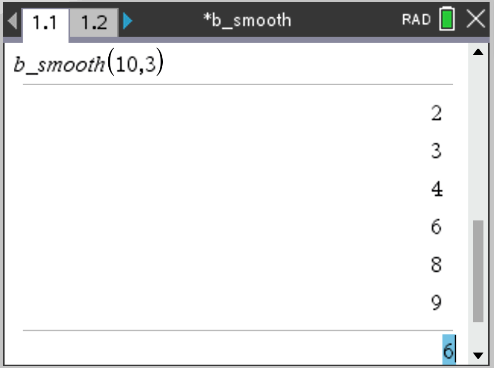

# B-smooth-calculator
Ti-inspire program that prints out a list of B-smooth numbers given a range and returns the amount of B-smooth numbers

## How to run and use the server:
- place the server directory on a computer you want to host the server on.
- open a terminal in the server directory
- run the server executable file by typing `./server -r <assign port number>` on the command line
- to add files you want to store on the server, place them in the "BIMDC" directory

